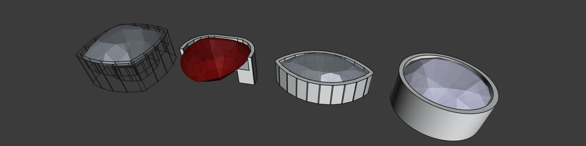

# FreeCAD Jewelry Workbench
This project provides tools for goldsmiths and jewelry designers to model rings and other jewelry in FreeCAD. It aims to be an alternative to commercial software packages like [3design](https://3design.com/en/) and [MatrixGold](https://gemvision.com/matrixgold).

## Current Features
- Adding parametric rings
- Importing [GemCad](https://www.gemcad.com/)/[Datavue II](http://www.gemcutter.com/dv_prg.htm) *.asc files
- Generating bezel settings for arbitrary faceted gemstones

## Basic Usage
After [installation](https://wiki.freecad.org/How_to_install_additional_workbenches), switch to the Jewelry workbench. To add a ring, click on the "Add Ring" button to insert one with a default size. Afterwards, it can be selected and its parameters (like size and profile) edited in the properties tab.

To insert a gemstone, search for an "open design" on [facetdiagrams.org](https://www.facetdiagrams.org/database/) and download the accompanying *.asc file. This can be imported into FreeCAD by selecting "File > Import" and choosing the downloaded model.
The workbench can now automatically generate a bezel setting for the gem. To do so, just select it and click "Add setting".

## License
This project is licensed under the terms of the GNU Affero General Public License, version 3 or any later version.  
I'm not sure this is the right license for an LGPL project like FreeCAD, so if in the future compatibility issues with other projects arise, I'm open to changing the license to plain GPL or the LGPL and I would like to ask potential contributers to agree to that.
